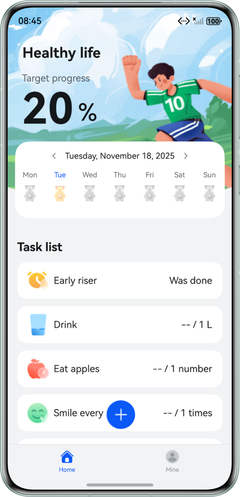
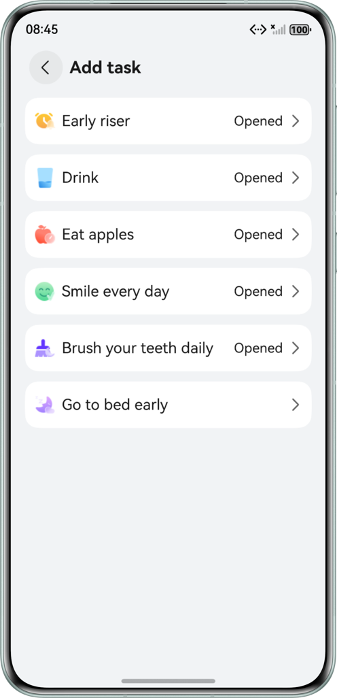
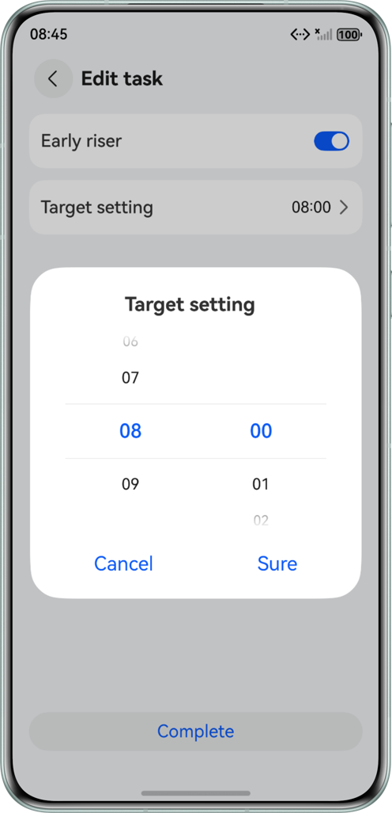
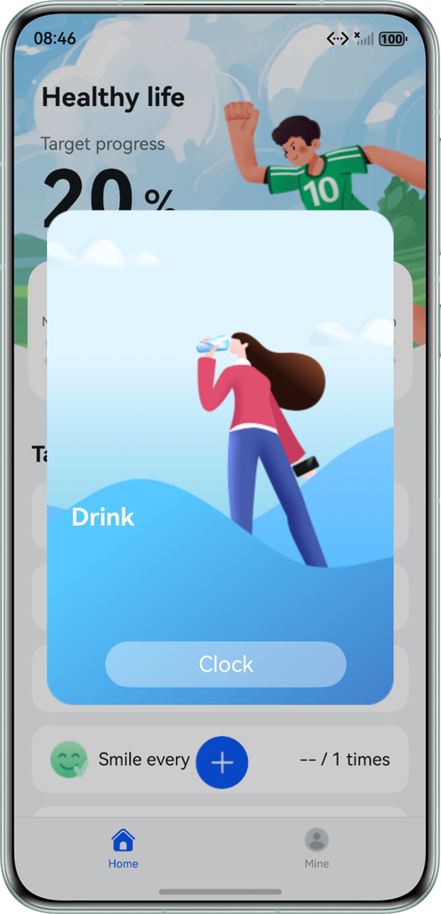
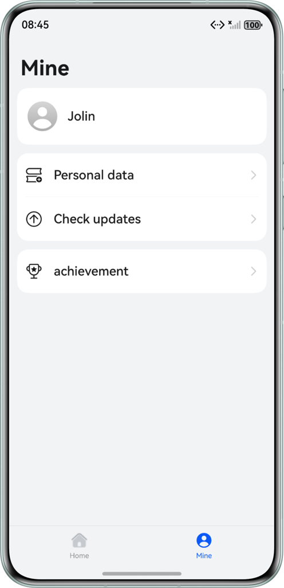
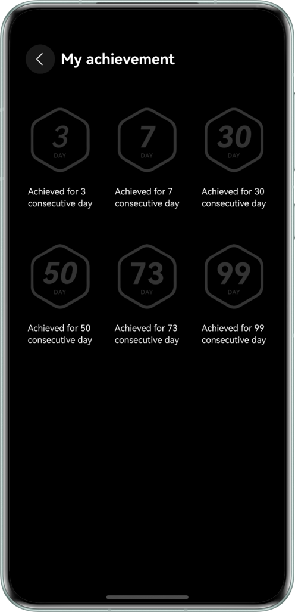
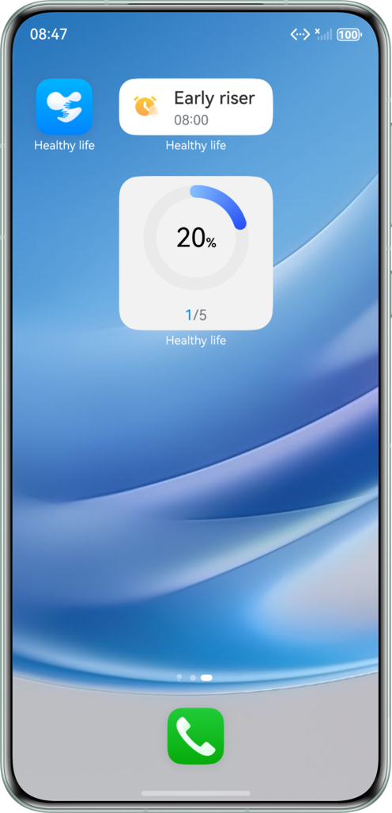
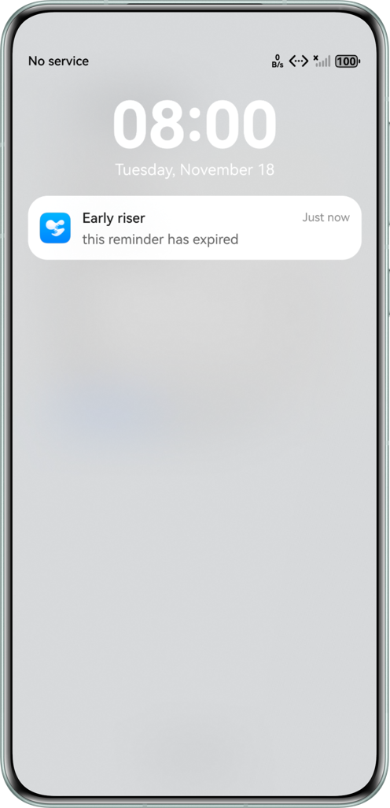

# Healthy Life Application

## Overview

This sample demonstrates how to implement a healthy life application based on the ArkTs declarative development paradigm and HarmonyOS RDB store.

## Effect

|  |  |  |  |
|------------------------------------------------------------|------------------------------------------------------------|------------------------------------------------------------|------------------------------------------------------------|

|  |  |  |  |  
|------------------------------------------------------------|------------------------------------------------------------|------------------------------------------------------------|------------------------------------------------------------|

## How to Use

1. Users can create up to six tasks (such as, to get up early, drink water, eat apples, smile every day, brush teeth, and go to bed early), and set task goals.
2. Check in on the home page. Some tasks require users to check in once, while others may require users to check in for multiple times.
3. The home page displays daily progress of tasks. The progress reaches 100% once all tasks are completed, and the number of consecutive check-in days increases by one.
4. When the number of consecutive check-in days hits 3, 7, 30, 50, 73, or 99, users can obtain the corresponding achievements. These achievements can be viewed in animation on the My achievements page.
5. Users can also check the completion status of historical tasks.
6. To add a task, tap the plus sign (+) on the home page. All added tasks will be displayed in the task list.
7. To add a 1 x 2 widget, exit the application to the background, long-press the application icon, tap the service widget, select the 1 x 2 widget, and add it to the home screen. Added tasks will be shown on the widget.
8. To add a 2 x 2 widget, follow the same steps as adding the 1 x 2 widget, but select the 2 x 2 option instead. This widget displays task progress.
9. Tap either the 1 x 2 or 2 x 2 widget to open the application home page and view the task list.
10. Set the widget update time in the widget configuration file. When the update time arrives, the 1 x 2 or 2 x 2 widget on the home screen will reset tasks for the next day. Note that widgets need to be added again after reset.
11. Users can set reminders only for getting up early and going to bed early.

## Project Directory

```
├───common/src/main/ets
│  ├──constants
│  │  ├──CommonConstants.ets                      // Common constants
│  │  └──RdbConstant.ets                          // RDB store constants - database related
│  ├──database
│  │  ├──tables 
│  │  │  ├──DayInfoApi.ets                        // Date information - database operation API
│  │  │  ├──DayTaskInfoApi.ets                    // Task information on the current day - database operation API
│  │  │  ├──FormInfoApi.ets                       // Service widget information - database operation API
│  │  │  ├──TableApi.ets                          // Database operation API
│  │  │  └──TaskInfoApi.ets                       // Task information - database operation API
│  │  └──RdbUtils.ets                             // Common utilities for database operations
│  ├──model
│  │  ├──database
│  │  │  ├──DayInfo.ets                           // Date information
│  │  │  ├──DayTaskInfo.ets                       // Task information on the current day
│  │  │  ├──FormInfo.ets                          // Service widget information
│  │  │  └──TaskInfo.ets                          // Task information
│  │  ├──ColumnModel.ets                          // Field information in the database table
│  │  ├──FormStorageModel.ets                     // Data sharing entity of the service widget
│  │  └──TaskBaseModel.ets                        // Basic information about a single task
│  └──utils
│     ├──agent
│     │  ├──AgentUtils.ets                        // Agent-powered reminder utility
│     │  └──RequestAuthorization.ets              // Permission configuration utility
│     ├──FormUtils.ets                            // Service widget utility
│     ├──PreferencesUtils.ets                     // Preferences utility
│     ├──PromptActionClass.ets                    // Custom dialog utility
│     └──Utils.ets
└──common/src/main/resource
│
├───healthylife/src/main/ets
│  ├──healthyfileability
│  │  └──HealthylifeAbility.ets                   // Module entry
│  ├──model
│  │  ├──AchievementModel.ets                     // Achievement information entity
│  │  └──NavItemModel.ets                         // Application tab entity
│  ├──pages
│  │  └──HealthyLifePage.ets                      // Application entry page
│  ├──viewmodel
│  │  ├──dialog                                   // Custom dialog
│  │  │  ├──AchievementDialogParams.ets           // Achievement dialog parameters
│  │  │  ├──TargetSettingDialogParams.ets         // Target task dialog parameters
│  │  │  └──TaskInfoDialogParams.ets              // Task information dialog parameters
│  │  ├──AchievementStore.ets                     // Achievement synchronization storage based on preferences
│  │  └──HomeStore.ets                            // Database storage for UI display
│  └──view
│     ├──dialog                                   // Custom dialog
│     │  ├──AchievementDialog.ets                 // Achievement dialog
│     │  ├──TargetSettingDialog.ets               // Target setting dialog
│     │  └──TaskClockCustomDialog.ets             // Check-in dialog
│     ├──home
│     │  ├──HomeTopComponent.ets                  // Target progress component
│     │  ├──TaskListComponent.ets                 // Task list component
│     │  └──WeekCalendarComponent.ets             // Weekly view component
│     ├──mine
│     │  └──UserInfoComponent.ets                 // User information component
│     ├──task
│     │  ├──AddTaskComponent.ets                  // Component for adding tasks
│     │  └──EditTaskComponent.ets                 // Component for editing tasks
│     ├──AchievementComponent.ets                 // Achievement page
│     ├──HomeComponent.ets                        // Home page
│     └──MineComponent.ets                        // Mine page
└──healthylife/src/main/resource
│
├───default/src/main/ets
│  ├──agency
│  │  └──pages
│  │     └──AgencyCard.ets                        // Task list - service widget
│  ├──defaultformability
│  │  └──DefaultFormAbility.ets                   // Service widget entry
│  ├──entryability
│  │  └──EntryAbility.ets                         // Entry ability
│  ├──pages
│  │  ├──AdvertisingPage.ets                      // Ad page
│  │  ├──Index.ets                                // Home page
│  │  └──SplashPage.ets                           // Splash page
│  ├──progress
│  │  └──pages
│  │     └──ProgressCard.ets                      // Task progress - service widget
│  └──view
│     └──UserPrivacyDialog.ets                    // Privacy agreement dialog
└──default/src/main/resource
```

## How to Implement

- AppStorage: a singleton object in an application. It provides central storage for variable state properties in the application.
- @Observed and @ObjectLink: @Observed applies to classes, indicating that data changes in the class are managed by the UI page. @ObjectLink applies to objects of the class decorated by @Observed.
- @Provide and @Consume: As the data provider, @Provide can update the data of child nodes and trigger page rendering. After @Consume detects that the @Provide data is updated, it will initiate re-rendering of the current view.
- Flex: a powerful container component. It supports horizontal layout and vertical layout as well as even and liquid wrapping layout of child components.
- List: one of the commonly used scrolling container components. It arranges its child components horizontally or vertically. The child components must be ListItem, with the same width as List by default.
- TimePicker: a time picker component. By default, a picker is created based on the time range from 00:00 to 23:59.
- Toggle: a component that provides a clickable element in the check box, button, or switch type.
- Relational database (RDB) store: a kind of database that manages data based on relational models.
- Preferences: provides APIs for processing data in the form of key-value (KV) pairs, including querying, modifying, and persisting KV pairs.
- ArkTS widget: consists of three modules: widget host, widget manager, and widget provider.
  - Widget host: creates, deletes, and updates widgets, and implements widget service communication.
  - Widget manager: updates widgets periodically, and manages widget caches, lifecycles, and widget hosts.
  - Widget provider: controls the display content, widget layout, and widget tap events.

## Required Permissions

ohos.permission.PUBLISH_AGENT_REMINDER: allows an application to use agent-powered reminders.

## Constraints

1. This sample is only supported on Huawei phones running standard systems.
2. The HarmonyOS version must be HarmonyOS 6.0.2 Release or later.
3. The DevEco Studio version must be DevEco Studio 6.0.2 Release or later.
4. The HarmonyOS SDK version must be HarmonyOS 6.0.2 Release SDK or later.
