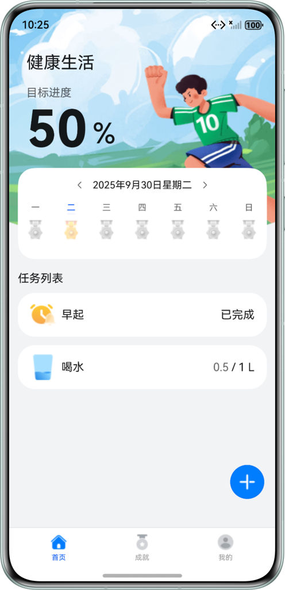
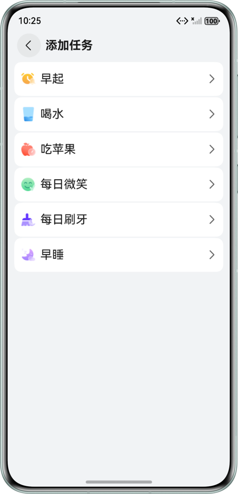
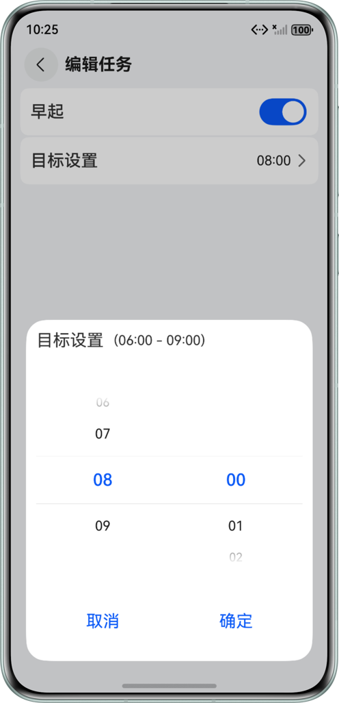
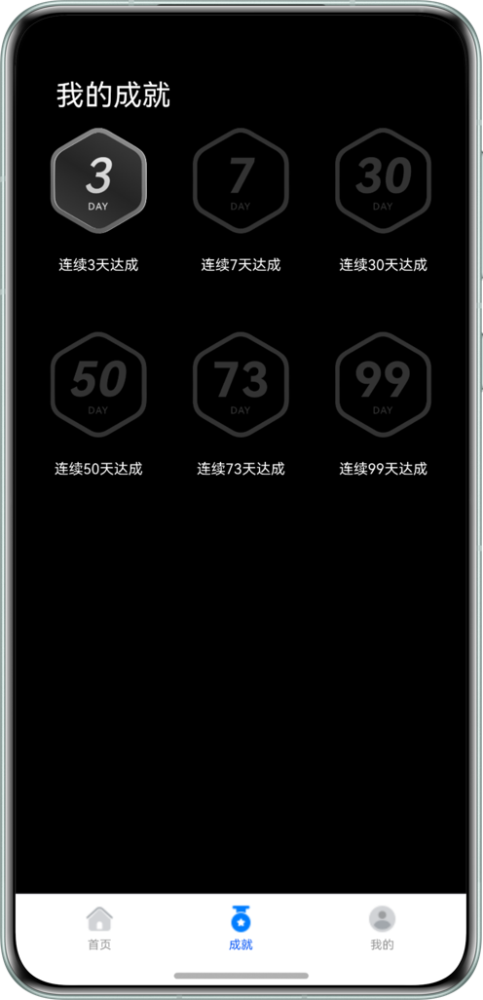

# 课表日程助手

## 项目简介

本项目基于华为 HarmonyOS Codelab 示例 HealthyLife 改造，使用 ArkTS 声明式开发范式、HarmonyOS 关系型数据库、周视图组件、任务列表、时间选择和后台代理提醒能力，实现一个面向学生的课表日程助手原型。

当前版本先完成基础改造：把原来的健康打卡任务改为课程和学习任务，支持在今日安排中添加、查看、完成学习安排。后续可以继续扩展课表导入、任务自动排程、课程地点、开始/结束时间和提醒策略。

## 效果预览

原项目截图仍保留在 `screenshots` 目录中。当前界面文案已改为课表日程助手，运行后可在首页看到“今日安排”“今日完成”等学习日程相关内容。

|    |    |  |   |
|-----------------------------------------------------------|-----------------------------------------------------------|---------------------------------------------------------|----------------------------------------------------------|

|    |    |  |   |
|-----------------------------------------------------------|-----------------------------------------------------------|---------------------------------------------------------|----------------------------------------------------------|

## 使用说明

1. 用户可以创建最多 6 类学习安排：上课、作业、阅读、复习、预习、晚自习。
2. 用户可以在首页查看当天安排，并通过“完成”操作记录今日学习进度。
3. 首页显示“今日完成”进度，所有安排完成后进度为 100%。
4. 用户可以通过加号进入“添加安排”页面，把课程或学习任务加入今日安排。
5. 用户可以进入“编辑安排”页面，对安排状态、计划目标或提醒时间进行调整。
6. 周视图组件用于查看不同日期的安排完成情况。
7. 服务卡片可以显示今日安排或学习进度。
8. 后台代理提醒能力可用于课程开始前、晚自习或重要任务的提醒。

## 当前改造内容

- 应用名称：由“健康生活”改为“课表日程助手”。
- 首页标题：改为“课表日程助手”。
- 首页模块：由“目标进度 / 任务列表”改为“今日完成 / 今日安排”。
- 任务类型：由“早起、喝水、吃苹果、每日微笑、刷牙、早睡”改为“上课、作业、阅读、复习、预习、晚自习”。
- 添加和编辑页面：改为“添加安排”“编辑安排”“计划设置”。
- 服务卡片：改为学习进度和今日安排相关文案。
- 阅读目标：改为 10、20、30、50、80 页。
- 时间范围：上课默认 08:00 - 12:00，晚自习默认 19:00 - 22:00。

## 工程目录

```
├── AppScope/resources/base/element/string.json
│   └── 应用名称配置
├── commons/common/src/main/ets
│   ├── constants
│   │   ├── CommonConstants.ets                  // 通用常量、任务目标范围
│   │   └── RdbConstants.ets                     // RDB 数据库相关常量
│   ├── database
│   │   ├── tables
│   │   │   ├── DayInfoApi.ets                   // 日期信息数据库操作
│   │   │   ├── DayTaskInfoApi.ets               // 当日安排数据库操作
│   │   │   ├── FormInfoApi.ets                  // 服务卡片数据库操作
│   │   │   ├── TableApi.ets                     // 数据库操作接口
│   │   │   └── TaskInfoApi.ets                  // 学习安排数据库操作
│   │   └── RdbUtils.ets                         // 数据库通用工具
│   ├── model
│   │   ├── database
│   │   │   ├── DayInfo.ets                      // 日期信息
│   │   │   ├── DayTaskInfo.ets                  // 当日安排信息
│   │   │   ├── FormInfo.ets                     // 服务卡片信息
│   │   │   └── TaskInfo.ets                     // 安排信息
│   │   ├── ColumnModel.ets                      // 数据库字段模型
│   │   ├── FormStorageModel.ets                 // 服务卡片共享数据模型
│   │   └── TaskBaseModel.ets                    // 学习安排基础配置
│   └── utils
│       ├── agent
│       │   ├── AgentUtils.ets                   // 后台代理提醒工具
│       │   └── RequestAuthorization.ets         // 权限请求工具
│       ├── FormUtils.ets                        // 服务卡片工具
│       ├── PreferencesUtils.ets                 // 首选项工具
│       ├── PromptActionClass.ets                // 弹窗工具
│       └── Utils.ets
├── features/healthylife/src/main/ets
│   ├── pages
│   │   └── HealthyLifePage.ets                  // 应用主页面入口
│   ├── viewmodel
│   │   ├── AchievementStore.ets                 // 成就/连续完成记录
│   │   └── HomeStore.ets                        // 首页数据状态
│   └── views
│       ├── HomeComponent.ets                    // 首页
│       ├── home
│       │   ├── HomeTopComponent.ets             // 今日完成进度
│       │   ├── TaskListComponent.ets            // 今日安排列表
│       │   └── WeekCalendarComponent.ets        // 周视图
│       ├── task
│       │   ├── AddTaskComponent.ets             // 添加安排
│       │   └── EditTaskComponent.ets            // 编辑安排
│       └── MineComponent.ets                    // 我的页面
└── products/default/src/main/ets
    ├── pages/Index.ets                          // 主入口页面
    ├── agency/pages/AgencyCard.ets              // 今日安排服务卡片
    └── progress/pages/ProgressCard.ets          // 学习进度服务卡片
```

## 具体实现

- ArkTS 声明式 UI：使用组件化方式构建首页、周视图、任务列表、添加和编辑页面。
- AppStorage / @Provide / @Consume：用于页面之间共享首页状态和安排数据。
- List：用于展示今日安排列表。
- TimePicker：用于设置课程或学习任务的提醒时间。
- Toggle：用于控制安排是否加入今日计划。
- 关系型数据库：用于保存日期、安排、当日完成情况和服务卡片信息。
- 首选项：用于保存轻量级状态，例如成就或连续完成记录。
- ArkTS 服务卡片：用于在桌面展示今日安排和学习进度。
- 后台代理提醒：用于课程、晚自习或重要学习任务提醒。

## 后续开发计划

1. 新增课程表数据模型：课程名、教室、星期、开始时间、结束时间。
2. 新增课表导入功能：先支持手动录入，后续支持 Excel、文本或图片识别。
3. 新增任务自动排程：根据空闲时间、截止时间和预计耗时，把作业/复习任务放入日程。
4. 新增课程提醒策略：上课前 10 分钟、任务截止前提醒。
5. 优化首页：区分“课程”和“任务”，展示今日时间线。

## 相关权限

允许应用使用后台代理提醒权限：`ohos.permission.PUBLISH_AGENT_REMINDER`

## 约束与限制

1. 本示例仅支持标准系统上运行，支持设备：华为手机。
2. HarmonyOS 系统：HarmonyOS 6.0.0 Release 及以上。
3. DevEco Studio 版本：DevEco Studio 6.0.2 Release 及以上。
4. HarmonyOS SDK 版本：HarmonyOS 6.0.2 Release SDK 及以上。
